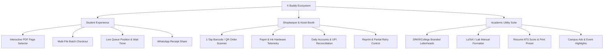

# X Buddy: Product Strategy, UX Enhancements & Feature Roadmap

## 1. Executive Summary & Core Product Vision
**X Buddy** transforms the chaotic, queue-heavy college Xerox shop experience into a seamless, contactless, self-service campus utility.
Students configure, preview, and pay for print jobs from their hostel or classroom; physical print jobs stream instantly to the shop's printer when verified at the kiosk booth.

To elevate X Buddy from a functional utility to an indispensable campus daily-driver, this proposal outlines:
1. **Core Product Principles** (The non-negotiable foundations guiding all future design & code).
2. **Immediate UX/UI Quick Wins** (High-impact ergonomics, feedback loops, and clarity).
3. **Core Feature Expansions** (Document manipulation, intelligent automation, kiosk upgrades).
4. **Resilience & Reliability Architecture** (Offline resilience, automated reconnection, notifications).
5. **Phase-by-Phase Execution Plan**.

---

## 2. Core Product & Design Principles

```
                  ┌────────────────────────────────────────┐
                  │          X BUDDY PRODUCT CREED         │
                  ├────────────────────────────────────────┤
                  │ 1. Zero Cognitive Overhead             │
                  │ 2. Predictable Financial Transparency  │
                  │ 3. Hardware-First Feedback & Empathy   │
                  │ 4. Resilience Over Perfection          │
                  │ 5. Campus Identity & Delight           │
                  └────────────────────────────────────────┘
```

### Principle 1: Zero Cognitive Overhead
* **Campus Reality:** Students are frequently in a rush right before 9:00 AM classes or lab viva.
* **Guideline:** Keep the "Document to Order ID" path under 3 taps for returning users. Avoid technical jargon like "DeviceGray PDF Conversion" or "Cloudflare Quick Tunnel timeout". State clear human actions: *"Ready to Print at Counter"*.

### Principle 2: Predictable Financial Transparency
* **Campus Reality:** Pocket money is tight; students are hyper-sensitive to surprise fees (e.g. ₹1 internet fee or double-sided vs single-sided pricing).
* **Guideline:** Show an interactive, live cost ticker dynamically calculating:
  `Pages x Copies x Rate + Processing = Total` in real-time as users click options. Never hide the formula.

### Principle 3: Hardware-First Empathy & Visibility
* **Campus Reality:** Physical printers jam, run out of paper, or need toner.
* **Guideline:** The UI must communicate real physical state. Never declare "Printed" if the Windows spooler failed, and always show a clear recovery state: *"Out of paper - notified shopkeeper"*.

### Principle 4: Resilience Over Perfection
* **Campus Reality:** College Wi-Fi drops, mobile 4G fluctuates in basement xerox shops, and laptops go to sleep.
* **Guideline:** Offline-first caching via LocalStorage/IndexedDB. Drafts, generated letters, and order receipts must persist even if the browser is reloaded or loses internet.

### Principle 5: Campus Community Delight
* **Campus Reality:** Campus tools should feel built by students, for students.
* **Guideline:** Keep modern micro-interactions, clean typography (Inter/Outfit), fluid Framer Motion transitions, and authentic campus toolkit features (Leave letters, Bonafide certificates, Resume formats).

---

## 3. High-Impact UX/UI Improvements

### A. Document Upload & Visual Inspection
1. **Interactive Multi-Page PDF Flip-Through Preview:**
   * *Current State:* Users see file name, size, and total page count.
   * *Improvement:* An in-browser thumbnail carousel or flip-through sheet selector allowing students to tap and deselect specific blank pages, title sheets, or reference pages visually (instead of typing `1-3, 5, 8` manually).
2. **Instant "Fit & Margin" Visualizer:**
   * Live preview bounding box showing how PowerPoint slides or multi-column papers will format on A4 paper before paying.
3. **Multi-File Batch Print Upload:**
   * Allow dragging multiple lab manuals, notes, and cover pages at once into a single bundle with one collective UPI checkout, rather than placing 3 separate orders.

### B. Payment & Verification Ergonomics
1. **UPI Deep-Link Smart Routing & Auto-App Detection:**
   * One-tap direct launch prioritizing PhonePe, GPay, Paytm on Android/iOS without generic deep-link dead-ends.
2. **Automatic UTR / Transaction ID Clipboard Extraction:**
   * When students return from PhonePe/GPay, automatically prompt: *"Paste copied UTR from clipboard?"* with 1-click fill to prevent transcription mistakes.
3. **Dynamic QR Code with Embedded Exact Amount:**
   * For desktop users, render a crisp UPI QR code that automatically locks the exact amount down to the rupee, preventing incorrect payments.

### C. Live Order Status & Pickup Tracking
1. **Interactive Timeline with Real-Time Queue Estimation:**
   * Instead of just "Waiting for shopkeeper", display:
     * *Estimated Wait Time:* `~2 mins (1 person ahead in queue)`
     * *Counter Status:* `Shopkeeper Terminal Online`
2. **Sound & Haptic Feedback on Completion:**
   * Play a clean, subtle audio chime and provide haptic vibration when the order transitions to `Ready for Collection`.
3. **Web Push & Web Share Notifications:**
   * Enable 1-tap browser notifications or a "Send Order Receipt to WhatsApp" button for sharing with friends or group members picking up prints together.

---

## 4. Proposed Feature Modules



### Module 1: The Fast-Lane QR Code Pickup
* **Problem:** Typing `XB6983` into the booth terminal on a keyboard or touchscreen can be slow when 10 students are waiting.
* **Solution:**
  * The student's order status page renders a large, high-contrast **Pickup QR Code**.
  * The kiosk PC can use an inexpensive 2D USB barcode scanner (or the shopkeeper's webcam/phone) to scan the screen in 0.2 seconds, immediately unlocking and spooling the job with zero typing.

### Module 2: Multi-Document Bundle Orders
* **Problem:** Students printing for project reviews need:
  1. Project Report (30 pages B&W Double-sided)
  2. Certificate Page (1 page Color Single-sided)
  3. Presentation Slides (4 pages, 2 slides per page)
* **Solution:** A unified Cart/Bundle workflow where multiple documents can have distinct print settings and be paid for in a single UPI transaction.

### Module 3: Advanced Academic Toolkits
* **College Form Fillers:**
  * Pre-built templates for Bonafide, Leave letter, On-Duty (OD) form, Fee Reimbursement requests, and Library No-Due forms with official formatting.
* **Lab Record & Cover Page Generator:**
  * Clean, standardized cover sheets with student Roll Number, Branch, Subject Name, and College Crest ready to print in 1 click.
* **Resume Print Presets:**
  * Preset formatting on heavy/bond paper options or crisp monochrome contrast optimization.

### Module 4: Shopkeeper Analytics & Hardware Guard
* **Paper & Ink Telemetry:**
  * Warn shopkeeper when page count reaches 100/200/500 to check paper tray before batch runs.
* **End-of-Day Settlement Summary:**
  * Summary tab showing: Total Prints, B&W count, Color count, Total UPI collected, and discrepancy logs.

---

## 5. Architectural & Resilience Principles

### 1. Robust Tunnel Self-Healing & Permanent URLs
* **Challenge:** Quick Tunnels (`trycloudflare.com`) rotate random subdomains on restart.
* **Enhancement:**
  * Configure a free permanent **Cloudflare Named Tunnel** with a token (e.g. `kiosk.xbuddy.app` or similar) so the tunnel address never changes across reboots.
  * In the local agent, implement an automated heartbeat loop that reports status directly to MongoDB every 30 seconds.

### 2. Dual-Channel Release Architecture
* If the tunnel drops temporarily, the frontend can post release instructions directly to the cloud backend (`POST /api/orders/release`).
* The local print agent polls the backend every 3 seconds for new release tokens, meaning **printing will succeed even if the direct inbound tunnel experiences firewall or ISP hiccups.**

### 3. PWA (Progressive Web App) Installability
* Add a Web App Manifest and Service Worker so students can tap **"Install X Buddy"** on Chrome/Safari to get a native app icon on their home screen with instant loading and offline order history.

---

## 6. Implementation Prioritization Matrix

| Priority | Feature / Improvement | Impact | Complexity | User Segment |
| :---: | :--- | :---: | :---: | :--- |
| **P0** | **Visual PDF Page Thumbnail Selector** | 🔥 High | Low | All Students |
| **P0** | **Render Keep-Alive / Wake Health Signal** | 🔥 High | Very Low | System Stability |
| **P1** | **Pickup QR Code on Order Screen + Booth Scanner** | ⚡ High | Medium | Shopkeeper & Students |
| **P1** | **PWA Installable App Banner + Offline Receipts** | ⚡ High | Low | Regular Campus Users |
| **P1** | **Live Queue Position (`2 orders ahead`)** | ⚡ High | Medium | Students Waiting |
| **P2** | **Multi-File Bundle / Cart Checkout** | 🚀 High | High | Project & Lab Students |
| **P2** | **Cloud Release Polling (Dual-Channel Tunnel Fallback)** | 🛡️ High | Medium | Print Agent & Booth |
| **P3** | **Official College Lab Cover Page & OD Form Suite** | 🌟 Medium | Low | Academic Tool Users |
| **P3** | **Permanent Cloudflare Named Tunnel Migration** | 🛡️ Medium | Low | DevOps / Maintenance |

---

## 7. Next Steps & Recommendation
1. **Phase 1 (Immediate UX Delight):** Visual page range picker, PWA manifest, and pickup QR code.
2. **Phase 2 (Speed & Throughput):** Multi-file bundle upload and queue position tracker.
3. **Phase 3 (Enterprise Hardening):** Permanent named Cloudflare tunnel and dual-channel agent polling.
